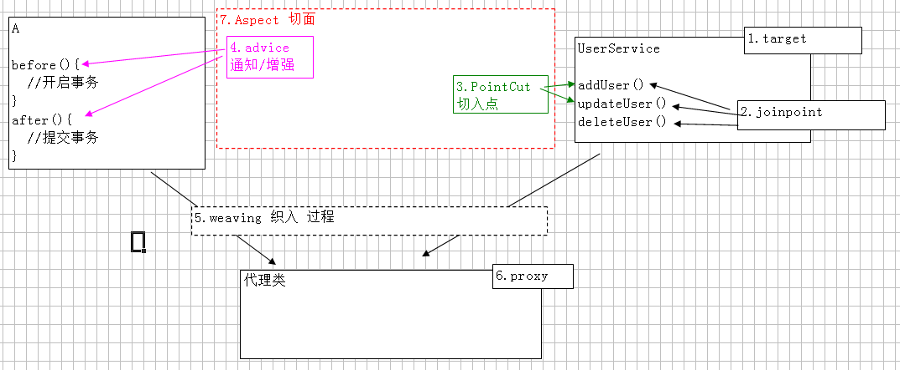

<!-- TOC depthFrom:1 depthTo:6 withLinks:1 updateOnSave:1 orderedList:0 -->

- [Spring AOP learning notes](#spring-aop-learning-notes)
	- [AOP介绍](#aop介绍)
	- [手动生成代理（JDKProxy cglib）](#手动生成代理jdkproxy-cglib)
		- [JDK动态代理](#jdk动态代理)
		- [cglib动态代理](#cglib动态代理)
	- [AOP联盟通知类型](#aop联盟通知类型)
	- [使用AOP联盟定义的环绕通知实现Spring半自动的代理](#使用aop联盟定义的环绕通知实现spring半自动的代理)
	- [Spring全自动的AOP](#spring全自动的aop)

<!-- /TOC -->

# Spring AOP learning notes

## AOP介绍

1. 什么是AOP

  - 在软件业，AOP为Aspect Oriented Programming的缩写，意为：面向切面编程，通过预编译方式和运行期动态代理实现程序功能的统一维护的一种技术。AOP是OOP（面向对象编程）的延续，是软件开发中的一个热点，也是Spring框架中的一个重要内容，是函数式编程的一种衍生范型。利用AOP可以对业务逻辑的各个部分进行隔离，从而使得业务逻辑各部分之间的耦合度降低，提高程序的可重用性，同时提高了开发的效率。
  - AOP采取横向抽取机制，取代了传统纵向继承体系重复性代码
  - 经典应用：事务管理、性能监视、安全检查、缓存 、日志等
  - Spring AOP使用纯Java实现，不需要专门的编译过程和类加载器，在运行期通过代理方式向目标类织入增强代码
  - AspectJ是一个基于Java语言的AOP框架，Spring2.0开始，Spring AOP引入对Aspect的支持，AspectJ扩展了Java语言，提供了一个专门的编译器，在编译时提供横向代码的织入

2. AOP实现原理

  - aop底层采用代理机制进行实现。
  - 接口 + 实现类 ：spring采用 jdk 的动态代理Proxy。
  - 只有实现类：spring 采用 cglib字节码增强。

3. AOP术语

  - target：目标类，需要被代理的类。例如：UserService
  - Joinpoint 连接点:所谓连接点是指那些可能被拦截到的方法。例如：`UserService`的所有方法
  - PointCut 切入点：已经被增强的连接点。例如：`addUser()`
  - advice 通知/增强，增强代码。例如：`after()`、`before()`
  - Weaving 织入:是指把增强advice应用到目标对象target来创建新的代理对象proxy的过程.
  - proxy 代理类
  - Aspect 切面: 是切入点pointcut和通知advice的结合<br>
    一个线是一个特殊的面<br>
    一个切入点和一个通知，组成成一个特殊的面
  - 图示 

## 手动生成代理（JDKProxy cglib）

> 0500_Proxy

### JDK动态代理

- JDK动态代理 对"装饰者"设计模式 简化。使用前提：必须有接口

  1. 目标类：接口 + 实现类 UserService+UserServiceImpl
  2. 切面类：用于存通知 MyAspect->before() after()
  3. 工厂类：编写工厂生成代理 MyBeanFactory

    ```
    public class MyBeanFactory {
    public static UserService createUserService() {
      // 目标类
      UserService userService = new UserServiceImpl();
      // 切面类
      MyAspect myAspect = new MyAspect();
      /* 代理类：将目标类（切入点）和 切面类（通知） 结合 --> 切面
          *     Proxy.newProxyInstance
          *         参数1：loader ，类加载器，动态代理类 运行时创建，任何类都需要类加载器将其加载到内存。
          *             一般情况：当前类.class.getClassLoader();
          *                     目标类实例.getClass().get...
          *         参数2：Class[] interfaces 代理类需要实现的所有接口
          *             方式1：目标类实例.getClass().getInterfaces()  ;注意：只能获得自己接口，不能获得父元素接口
          *             方式2：new Class[]{UserService.class}
          *             例如：jdbc 驱动  --> DriverManager  获得接口 Connection
          *         参数3：InvocationHandler  处理类，接口，必须进行实现类，一般采用匿名内部
          *             提供 invoke 方法，代理类的每一个方法执行时，都将调用一次invoke
          *                 参数31：Object proxy ：代理对象
          *                 参数32：Method method : 代理对象当前执行的方法的描述对象（反射）
          *                     执行方法名：method.getName()
          *                     执行方法：method.invoke(对象，实际参数)
          *                 参数33：Object[] args :方法实际参数
          *
      */

      UserService proxy = null;
      proxy = (UserService) Proxy.newProxyInstance(MyBeanFactory.class.getClassLoader(),
        userService.getClass().getInterfaces(),
        new InvocationHandler() {
          @Override
          public Object invoke(Object proxy, Method method, Object[] args) throws Throwable {
            myAspect.before();
            Object result = method.invoke(userService, args);
            myAspect.after();
            return result;
          }
      });

      return proxy;
    }
    }
    ```

### cglib动态代理

- 没有接口，只有实现类
- 采用字节码增强框架 cglib，在运行时 创建目标类的子类，从而对目标类进行增强
- 自己导入jar包的话，需要`cglib`和`asm`,`spring-core`已经集成了这两个包，只需将其导入即可

## AOP联盟通知类型

- AOP联盟为通知Advice定义了org.aopalliance.aop.Advice
- Spring按照通知Advice在目标类方法的连接点位置，可以分为5类

  1. 前置通知 org.springframework.aop.MethodBeforeAdvice 在目标方法执行前实施增强
  2. 后置通知 org.springframework.aop.AfterReturningAdvice 在目标方法执行后实施增强
  3. 环绕通知 org.aopalliance.intercept.MethodInterceptor 在目标方法执行前后实施增强
  4. 异常抛出通知 org.springframework.aop.ThrowsAdvice 在方法抛出异常后实施增强
  5. 引介通知 org.springframework.aop.IntroductionInterceptor 在目标类中添加一些新的方法和属性

- 环绕通知，必须手动执行目标方法

  ```
  try{
     //前置通知
     //执行目标方法
     //后置通知
  } catch(){
     //抛出异常通知
  }
  ```

## 使用AOP联盟定义的环绕通知实现Spring半自动的代理

1. 目标类：UserService，其中包括三个方法
2. 切面类：MyAspect

  ```
  public class MyAspect implements MethodInterceptor {
     @Override
     public Object invoke(MethodInvocation invocation) throws Throwable {
         System.out.println("aspect before...");
         Object result = invocation.proceed();   // 必须手动调用目标类的方法
         System.out.println("aspect after...");

         return result;
     }
  }
  ```

3. Spring配置

  ```
  <!-- 1.目标类-->
  <bean id="userService" class="com.liuhy.springproxy.UserServiceImpl"/>

  <!-- 2.切面类-->
  <bean id="myAspect" class="com.liuhy.springproxy.MyAspect"/>

  <!-- 3.代理类
  * 使用工厂bean FactoryBean ，底层调用 getObject() 返回特殊bean
  * ProxyFactoryBean 用于创建代理工厂bean，生成特殊代理对象
    interfaces : 确定接口们
      通过<array>可以设置多个值
      只有一个值时，value=""
    target : 确定目标类
    interceptorNames : 通知 切面类的名称，类型String[]，如果设置一个值 value=""
    optimize :强制使用cglib
      <property name="optimize" value="true"></property>
  底层机制
    如果目标类有接口，采用jdk动态代理
    如果没有接口，采用cglib 字节码增强
    如果声明 optimize = true ，无论是否有接口，都采用cglib
  -->
  <bean id="proxyService" class="org.springframework.aop.framework.ProxyFactoryBean">
        <property name="interfaces" value="com.liuhy.springproxy.UserService"></property>
        <property name="target" ref="userService"></property>
        <property name="interceptorNames" value="myAspect"></property>
        <property name="optimize" value="true"></property>
  </bean>
  ```

4. 问题：这种方式在`getBean()`时拿到的是`proxyService`而不是`userService`

## Spring全自动的AOP

> 0700_Spring_AOP

1. 创建目标类：UserService
2. 创建切面类：MyAspect<br>
  切面类仍要实现AOP联盟定义的环绕方法接口
3. 配置Spring AOP

  ```
  <!-- 1.目标类-->
  <bean id="userService" class="com.liuhy.springaop.UserServiceImpl"/>

  <!-- 2.切面(通知)类-->
  <bean id="myAspect" class="com.liuhy.springaop.MyAspect"/>

  <!-- 3.aop配置

  使用 <aop:config>进行配置
     proxy-target-class="true" 声明使用cglib代理
  <aop:pointcut> 切入点 ，从目标对象获得具体方法
  <aop:advisor> 特殊的切面，只有一个通知 和 一个切入点
     advice-ref 切面引用
     pointcut-ref 切入点引用
  -->
  <aop:config>
   <aop:pointcut id="userServicePointCut" expression="execution(* com.liuhy.springaop.*.*(..))"/>
   <aop:advisor pointcut-ref="userServicePointCut" advice-ref="myAspect"/>
  </aop:config>
  ```
