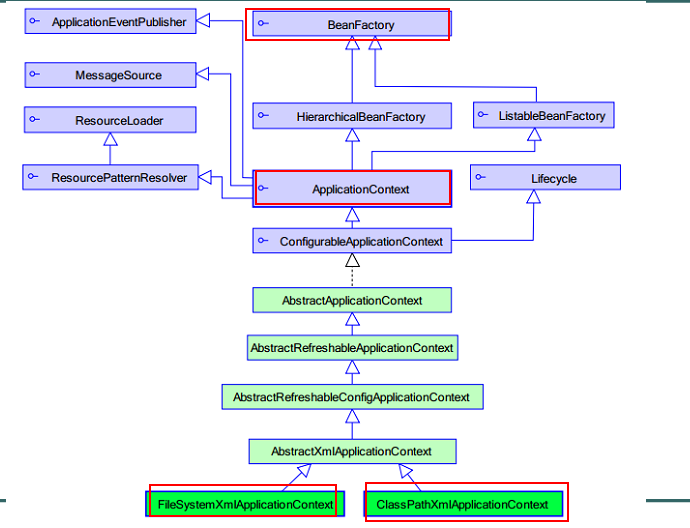
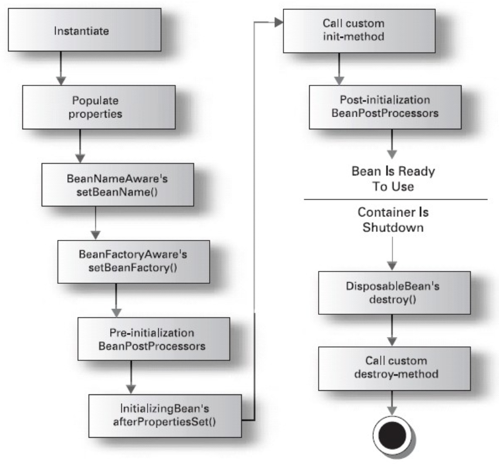

[TOC]

# Spring Ioc and DI learning notes

## 0100_IoC

> 需求：之前开发中，想要得到一个userService实例都是直接new出来，这个demo尝试用Spring的IoC拿到

1. 导入jar包<br>
  beans、core、context、expression、commons-logging
2. 配置文件

  - 位置：任意，开发中一般在classpath下（src）
  - 名称：任意，开发中常用`applicationContext.xml`
  - 内容：添加schema约束<br>
    约束文件位置：`http://docs.spring.io/spring-framework/docs/current/spring-framework-reference/html/xsd-configuration.html`

3. 测试：

  ```
  String xmlPath = "beans.xml";
  ApplicationContext applicationContext = new ClassPathXmlApplicationContext(xmlPath);
  ```

## 0200_DI

> 需求：在UserService中需要一个UserDao的实例，尝试通过Spring的配置文件把这个实例注入进去

1. 导入jar包的步骤和上面项目一样，之后的项目会直接省略这步的说明
2. 创建`UserDao`和`UserService`类，在`UserService`中创建`userDao`成员变量以及`setter`方法，提供给Spring使用
3. 配置文件

  ```
  <property> 用于进行属性注入
  name： bean的属性名，通过setter方法获得
  setBookDao ##> BookDao  ##> bookDao
  ref ：另一个bean的id值的引用

  <!-- 创建service -->
  <bean id="bookServiceId" class="com.liuhy.BookServiceImpl">
  <property name="bookDao" ref="bookDaoId"></property>
  </bean>

  <!-- 创建dao实例 -->
  <bean id="bookDaoId" class="com.liuhy.BookDaoImpl"></bean>
  ```

## Spring核心API



- BeanFactory ：这是一个工厂，用于生成任意bean<br>
  采取延迟加载，第一次getBean时才会初始化Bean
- ApplicationContext：是BeanFactory的子接口，功能更强大。（国际化处理、事件传递、Bean自动装配、各种不同应用层的Context实现）。当配置文件被加载，就进行对象实例化。

## XML形式装配Bean

> 0300_BeanFactory

### 默认构造

上面两个demo用的都是这种方法

### 静态工厂

- 常用于spring整合其他框架（工具）
- 静态工厂：自己创建的工厂类，用于生成实例对象，所有的方法必须是static
- `<bean id="" class="工厂全限定类名" factory-method="静态方法">`
- 与上一种方法的区别就是，这个工厂是自己创建的，上面的spring就是一个工厂

### 实例工厂

- 实例工厂同样是自己创建工厂，不同的是，在配置文件中将这个工厂配置成一个`bean`

  ```
  <!-- 创建工厂实例 -->
  <bean id="myBeanFactory" class="com.liuhy.MyBeanFactory"></bean>
  <!-- 获得userservice
      * factory-bean 确定工厂实例
      * factory-method 确定普通方法
  -->
  <bean id="userService" factory-bean="myBeanFactory" factory-method="createUserService"></bean>
  ```

### Bean种类

- 普通bean：之前操作的都是普通bean。`<bean id="" class="A">` ，spring直接创建A实例，并返回
- FactoryBean：是一个特殊的bean，具有工厂生成对象能力，只能生成特定的对象。<br>
  bean必须使用 FactoryBean接口，此接口提供方法 `getObject()` 用于获得特定bean。<br>
  `<bean id="" class="FB">` 先创建FB实例，使用调用`getObject()`方法，并返回方法的返回值<br>
  FB fb = new FB();<br>
  return fb.getObject();
- BeanFactory 和 FactoryBean 对比？<br>
  BeanFactory：工厂，用于生成任意bean。<br>
  FactoryBean：特殊bean，用于生成另一个特定的bean。例如：ProxyFactoryBean ，此工厂bean用于生产代理。`<bean id="" class="....ProxyFactoryBean">` 获得代理对象实例。AOP使用

### Bean的作用域

- 取值<br>
  singleton 单例，默认值。<br>
  prototype 多例，每执行一次getBean将获得一个实例。例如：struts整合spring，配置action多例。

### 生命周期

1. 初始化和销毁<br>
  `<bean id="" class="" init-method="初始化方法名称" destroy-method="销毁的方法名称">`
2. PostBeanProcessor

  - 
  - Spring 提供一种机制，只要实现`BeanPostProcessor`接口，并将实现类提供给Spring(通过配置文件)，Spring将自动执行，在初始化方法前执行`postProcessBeforeInitialization`，在初始化方法后执行`postProcessAfterInitialization`。 配置`<bean class="">`
  - 模拟

    ```
    A a =new A();
    a = B.before(a) --> 将a的实例对象传递给后处理bean，可以生成代理对象并返回。
    a.init();
    a = B.after(a);
    a.addUser(); //生成代理对象，目的在目标方法前后执行（例如：开启事务、提交事务）
    a.destroy()
    ```

  - 这个后处理bean默认会作用域所有bean的生成，如果要处理特定的bean，可以在代理类中通过beanName判断

### JavaBean中的属性注入

1. 构造方法注入

  ```
  <!-- 构造方法注入
  * <constructor-arg> 用于配置构造方法一个参数argument
  name ：参数的名称
  value：设置普通数据
  ref：引用数据，一般是另一个bean id值

  index ：参数的索引号，从0开始 。如果只有索引，匹配到了多个构造方法时，默认使用第一个。
  type ：确定参数类型
  例如：使用名称name
  <constructor-arg name="username" value="jack"></constructor-arg>
  <constructor-arg name="age" value="18"></constructor-arg>
  例如2：【类型type 和  索引 index】
  <constructor-arg index="0" type="java.lang.String" value="1"></constructor-arg>
  <constructor-arg index="1" type="java.lang.Integer" value="2"></constructor-arg>
  -->
  <bean id="userId" class="com.liuhy.User" >
  <constructor-arg index="0" type="java.lang.String" value="1"></constructor-arg>
  <constructor-arg index="1" type="java.lang.Integer" value="2"></constructor-arg>
  </bean>
  ```

2. setter方法注入

  ```
  <!-- setter方法注入
  * 普通数据
  <property name="" value="值">
  等效
  <property name="">
  <value>值
  * 引用数据
  <property name="" ref="另一个bean">
  等效
  <property name="">
  <ref bean="另一个bean"/>
  -->
  <bean id="personId" class="com.liuhy.Person">
  <property name="name" value="zhangsan"></property>
  <property name="age">
  <value>12</value>
  </property>

  <property name="homeAddr" ref="homeAddrId"></property>
  <property name="companyAddr">
  <ref bean="companyAddrId"/>
  </property>
  </bean>

  <bean id="homeAddrId" class="com.liuhy.Address">
  <property name="addr" value="Beijing"></property>
  <property name="tel" value="911"></property>
  </bean>
  <bean id="companyAddrId" class="com.liuhy.Address">
  <property name="addr" value="北京八宝山"></property>
  <property name="tel" value="120"></property>
  </bean>
  ```

3. 集合属性的注入

  ```
  <!--
  集合的注入都是给<property>添加子标签
  数组：<array>
  List：<list>
  Set：<set>
  Map：<map> ，map存放k/v 键值对，使用<entry>描述
  *Properties：<props>  <prop key=""></prop>

  普通数据：<value>
  引用数据：<ref>
  -->
  <bean id="collDataId" class="com.itheima.f_xml.e_coll.CollData" >
  <property name="arrayData">
  <array>
  <value>DS</value>
  <value>DZD</value>
  <value>屌丝</value>
  <value>屌中屌</value>
  </array>
  </property>

  <property name="listData">
  <list>
  <value>于嵩楠</value>
  <value>曾卫</value>
  <value>杨煜</value>
  <value>曾小贤</value>
  </list>
  </property>

  <property name="setData">
  <set>
  <value>停封</value>
  <value>薄纸</value>
  <value>关系</value>
  </set>
  </property>

  <property name="mapData">
  <map>
  <entry key="jack" value="杰克"></entry>
  <entry>
  <key><value>rose</value></key>
  <value>肉丝</value>
  </entry>
  </map>
  </property>

  <property name="propsData">
  <props>
  <prop key="高富帅">嫐</prop>
  <prop key="白富美">嬲</prop>
  <prop key="男屌丝">挊</prop>
  </props>
  </property>
  </bean>
  ```

## Annotation形式装配Bean

> 0400_BeanFactory_Annotation

- 使用注解的前提：添加命名空间，让spring扫描含有注解类
- The use of

  <context:component-scan> implicitly enables the functionality of <context:annotation-config>. There is usually no need to include the <context:annotation-config> element when using <context:component-scan>.</context:component-scan></context:annotation-config></context:annotation-config></context:component-scan>

  ```
  <beans xmlns="http://www.springframework.org/schema/beans"
            xmlns:xsi="http://www.w3.org/2001/XMLSchema-instance"
             xmlns:context="http://www.springframework.org/schema/context"
             xsi:schemalocation="http://www.springframework.org/schema/beans
                                  http://www.springframework.org/schema/beans/spring-beans.xsd
                                  http://www.springframework.org/schema/context
                                  http://www.springframework.org/schema/context/spring-context.xsd">
        <context:component-scan base-package="com.liuhy"></context:component-scan>
    </beans>
  ```

- `@Component`取代`<bean class="">`<br>
  `@Component("componentName")` 取代 `<bean id="componentName" class="">`

- Web开发，提供3个`@Component`衍生注解（功能一样）取代`<bean class="">`

  1. `@Repository`：dao层
  2. `@Service`：service层
  3. `@Controller`：web层

- 依赖注入，给私有字段设置，也可以给setter方法设置

  1. 普通值：`@Value("")`
  2. 引用值：<br>
    方式1：按照【类型】注入<br>
    `@Autowired`<br>
    方式2：按照【名称】注入1<br>
    `@Autowired`<br>
    `@Qualifier("名称")`<br>
    方式3：按照【名称】注入2<br>
    `@Resource(name="名称")`

    > `Autowired`属于spring，而`Resource`属于j2ee，这两个注解完成的功能一样，都是自动装配bean

- 生命周期

  1. 初始化：`@PostConstruct`
  2. 销毁：`@PreDestroy`

- 作用域<br>
  `@Scope("prototype")`多例

## 注解和xml混合使用

1. 将所有的bean都配置xml中<br>
  `<bean id="" class=""></bean>`
2. 将所有的依赖都使用注解 `@Autowired`， 默认不生效。为了生效，需要在xml配置：`<context:annotation-config></context:annotation-config>`
