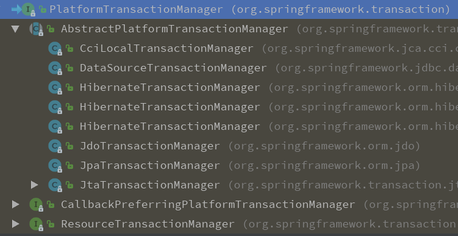
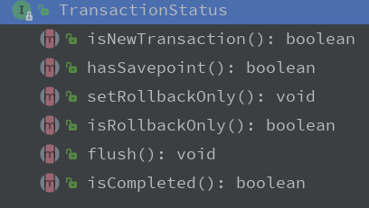
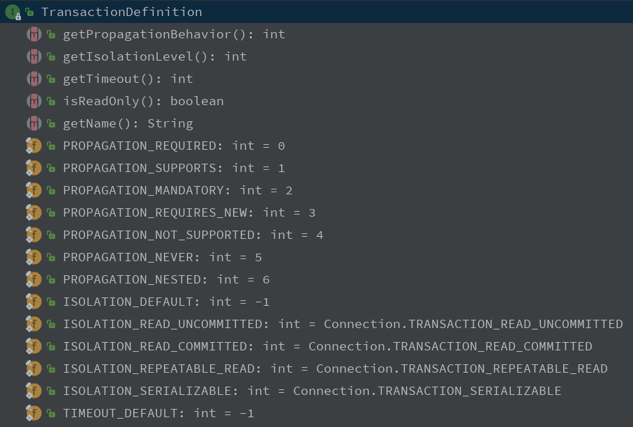

<!-- TOC depthFrom:1 depthTo:6 withLinks:1 updateOnSave:1 orderedList:0 -->

- [Spring Transaction learning notes](#spring-transaction-learning-notes)
	- [事务相关概念](#事务相关概念)
	- [Spring中进行事务开发相关信息](#spring中进行事务开发相关信息)
	- [转账案例](#转账案例)

<!-- /TOC -->

# Spring Transaction learning notes

## 事务相关概念
> 1300_Transaction

- 主要理解SavePoint（保存点的概念）
	```
		需求：AB（必须），CD（可选）
		Connection conn = null;
		Savepoint savepoint = null;  //保存点，记录操作的当前位置，之后可以回滚到指定的位置。（可以回滚一部分）
		try{
			//1 获得连接
			conn = ...;
			//2 开启事务
			conn.setAutoCommit(false);
			A
			B
			savepoint = conn.setSavepoint();
			C
			D
			//3 提交事务
			conn.commit();
		} catche(){
			if(savepoint != null){   //CD异常
				 // 回滚到CD之前
				 conn.rollback(savepoint);
				 // 提交AB
				 conn.commit();
			} else{   //AB异常
				 // 回滚AB
				 conn.rollback();
			}
		}
	```

## Spring中进行事务开发相关信息

- jar包
spring-tx

- 三个顶级接口
	1. `PlatformTransactionManager`：平台事务管理器，spring要管理事务，必须使用事务管理器
	2. `TransactionDefinition`：事务详情（事务定义、事务属性），spring用于确定事务具体详情，例如：隔离级别、是否只读、超时时间 等
	3. `TransactionStatus`：事务状态，spring用于记录当前事务运行状态。例如：是否有保存点，事务是否完成。spring底层根据状态进行相应操作。

- PlatformTransactionManager
	

	1. 这是spring定义的接口，其中包含三个方法
	2. 当我们需要进行jdbc开发时，引入jar包：`spring-jdbc`，其中包含实现类`DataSourceTransactionManager`
	3. 当我们需要进行hibernate开发时，引入jar包：`spring-orm`，其中包含实现类`HibernateTransactionManager`

- TransactionStatus
	

- TransactionDefinition
	

	1. PROPAGATION_REQUIRED , required , 必须  (默认值)
		支持当前事务，A如果有事务，B将使用该事务。
		如果A没有事务，B将创建一个新的事务。
	1. PROPAGATION_SUPPORTS ，supports ，支持
		支持当前事务，A如果有事务，B将使用该事务。
		如果A没有事务，B将以非事务执行。
	1. PROPAGATION_MANDATORY，mandatory ，强制
		支持当前事务，A如果有事务，B将使用该事务。
		如果A没有事务，B将抛异常。
	1. PROPAGATION_REQUIRES_NEW ， requires_new ，必须新的
		如果A有事务，将A的事务挂起，B创建一个新的事务
		如果A没有事务，B创建一个新的事务
	1. PROPAGATION_NOT_SUPPORTED ，not_supported ,不支持
		如果A有事务，将A的事务挂起，B将以非事务执行
		如果A没有事务，B将以非事务执行
	1. PROPAGATION_NEVER ，never，从不
		如果A有事务，B将抛异常
		如果A没有事务，B将以非事务执行
	1. PROPAGATION_NESTED ，nested ，嵌套
		A和B底层采用保存点机制，形成嵌套事务。

## 转账案例

- 创建表
	```
		create database learn_spring_transaction;
		use learn_spring_transaction;
		create table account(
			id int primary key auto_increment,
			username varchar(50),
			money int
		);
		insert into account(username,money) values('liu','10000');
		insert into account(username,money) values('ma','10000');
	```

- 所需jar包
	1. 核心：4 + 1
	2. AOP：4 (aop联盟、spring aop、aspectj规范、spring aspect)
	3. 数据库：2 (jdbc/tx)
	4. 驱动：mysql
	5. 连接池：HikariCP

### 1301_Transaction_Transfer
> 不使用事务的转账demo

### 1302_Transaction_Transfer_SpringAOP_XML
> 使用Spring AOP给转账业务加上事务，用XML配置

1. `AccountServiceImpl`
	```
		public class AccountServiceImpl2 implements AccountService {

			private AccountDao accountDao;

			public void setAccountDao(AccountDao accountDao) {
					this.accountDao = accountDao;
			}

			@Override
			public void transfer(String from, String to, int money) {
					accountDao.out(from, money);
					// 断电
					int i = 1/0;
					accountDao.in(to, money);
			}
		}
	```
2. Spring配置
	```
		<!-- 首先配置事务管理器-->
    <bean id="txManager" class="org.springframework.jdbc.datasource.DataSourceTransactionManager">
        <property name="dataSource" ref="dataSource"/>
    </bean>
    <!-- 再配置advice-->
    <tx:advice id="txAdvice" transaction-manager="txManager">
        <tx:attributes>
            <tx:method name="transfer" isolation="DEFAULT" propagation="REQUIRED"/>
        </tx:attributes>
    </tx:advice>
    <!-- 配置一个切面，将事务加上-->
    <aop:config>
        <aop:pointcut id="accountServicePointCut" expression="execution(* com.liuhy.service.*.* (..))"/>
        <aop:advisor advice-ref="txAdvice" pointcut-ref="accountServicePointCut"/>
    </aop:config>
	```

### 1303_Transaction_Transfer_SpringAOP_Annotation
> 使用Spring AOP给转账业务加上事务，用Annotation配置

1. 在Spring配置文件中配置
	```
	<!-- 加载配置文件-->
	<context:property-placeholder location="jdbcInfo.properties"/>

	<!-- 创建数据源-->
	<bean id="dataSource" class="com.zaxxer.hikari.HikariDataSource">
			<property name="driverClassName" value="${jdbc.driverClass}"/>
			<property name="jdbcUrl" value="${jdbc.url}"/>
			<property name="username" value="${jdbc.username}"/>
			<property name="password" value="${jdbc.password}"/>
	</bean>

	<!-- Dao-->
	<bean id="accountDao" class="com.liuhy.transfer.dao.AccountDaoImpl">
			<property name="dataSource" ref="dataSource"/>
	</bean>

	<!-- Service-->
	<bean id="accountService" class="com.liuhy.transfer.service.AccountServiceImpl">
			<property name="accountDao" ref="accountDao"/>
	</bean>

	<!-- 首先配置事务管理器-->
	<bean id="txManager" class="org.springframework.jdbc.datasource.DataSourceTransactionManager">
			<property name="dataSource" ref="dataSource"/>
	</bean>
	<!-- 设置成注解驱动的模式-->
	<tx:annotation-driven/>
	```

2. 在需要添加事务的类或方法上加上`@Transactional`注解
	```
		public class AccountServiceImpl implements AccountService {

			private AccountDao accountDao;

			public void setAccountDao(AccountDao accountDao) {
					this.accountDao = accountDao;
			}

			@Transactional(isolation = Isolation.DEFAULT, propagation = Propagation.REQUIRED)
			@Override
			public void transfer(String from, String to, int money) {
					accountDao.out(from, money);
					// 断电
					int i = 1/0;
					accountDao.in(to, money);
			}
		}
	```
